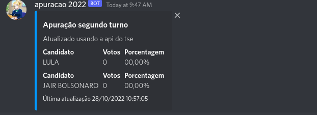
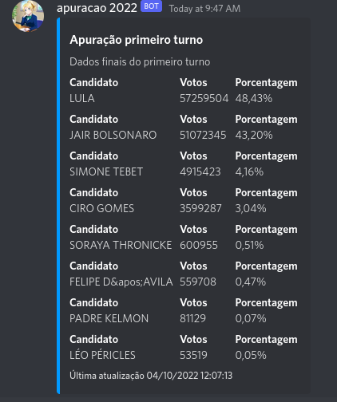

<h1 align="center">Apuração 2022 Discord bot</h1>
<p align="center">
  <strong>Feito para acompanhar o segundo turno</strong>
</p>

## Instruções de uso

Comando /apuracao:

<div align="center">
  <br>
    
  <br>
</div>

Comando /primeiroturno:

<div align="center">
  <br>
    
  <br>
</div>


## Servidor de desenvolvimento 🚀

Clonando o projeto:

```
git clone https://github.com/lulumarquezzini/apuracao-segundo-turno-discord-bot.git
```

Navegando até a pasta do projeto:

```
cd apuracao-segundo-turno-discord-bot/
```

Baixando as dependências do projeto

```bash
npm install
```

Rodando o projeto

```bash
npm start
```

Não se esqueça de configurar sua env
